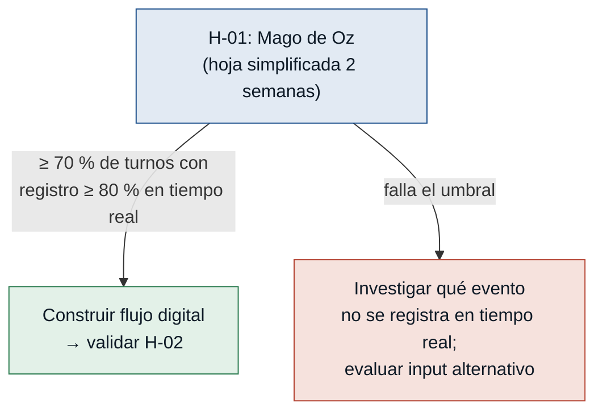
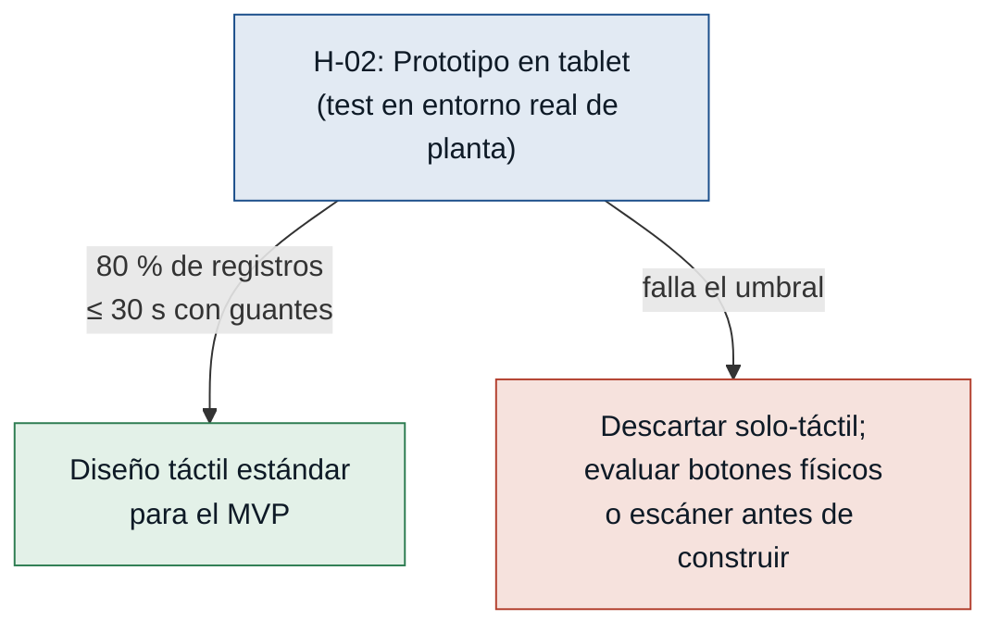
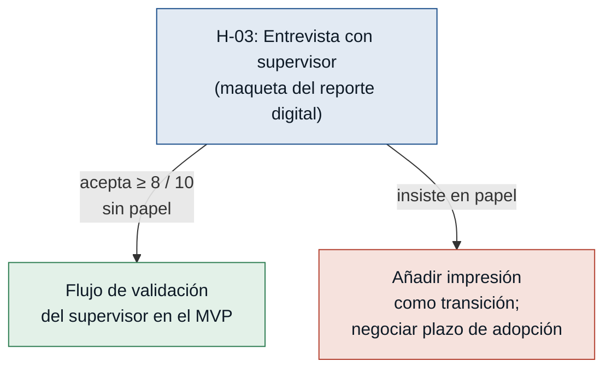
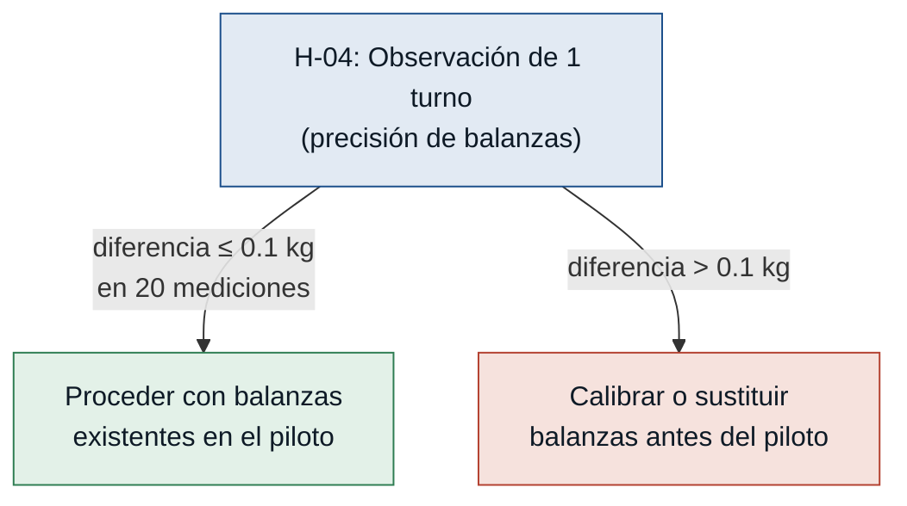

# Hipótesis y Experimentos — Lecplast

> Ordenadas de mayor a menor riesgo: primero se prueba lo que más puede
> tumbar el MVP. El experimento de H-01 debe ejecutarse antes de invertir
> en desarrollo de la interfaz (H-02) o en negociación con el supervisor (H-03).

---

### [H-01] Adopción del registro en tiempo real — riesgo: alto

- **Supuesto a probar:** Los operadores registrarán cada rollo o lote en el sistema durante el turno, sin percibirlo como carga adicional a su trabajo físico.

- **Hipótesis:** Creemos que los operadores de extrusión, impresión y sellado registrarán ≥ 80 % de los eventos de producción en tiempo real (sin esperar al final del turno) si el flujo de registro se completa en ≤ 30 segundos por evento, porque el único incentivo que tienen es no tener que sumar a mano al cierre; si el registro les cuesta más esfuerzo que la hoja actual, lo abandonarán.

- **Señal medible:** Porcentaje de eventos de producción registrados durante el turno (no al final) sobre el total de eventos del turno, promediado por operador.

- **Criterio de éxito:** Al menos el 70 % de los turnos piloto tienen un registro ≥ 80 % en tiempo real, durante las primeras 2 semanas de uso.

- **Experimento:** Mago de Oz con hoja de registro simplificada. Durante 2 semanas, un operador por rol usa una hoja rediseñada con un solo campo por evento (peso del rollo / conteo de bolsas / kilos de tinta) y lo anota al momento en lugar del papel actual. Un observador externo mide cuántos eventos se registran en tiempo real vs. al finalizar el turno.

- **Caja de tiempo / costo:** 2 semanas de piloto (3 operadores, 1 hoja por turno) + 2 horas de briefing inicial. Sin desarrollo de software. Costo estimado: 0 en tecnología; 8 horas de un investigador.

- **Regla de decisión:** Si pasa → construir el flujo digital táctil con confianza en la adopción; pasar a validar H-02. Si falla → investigar qué tipo de evento no se puede registrar en tiempo real; simplificar aún más el formulario o evaluar entrada alternativa (escáner de código, voz) antes de construir la interfaz digital.

---

### [H-02] Usabilidad táctil en entorno de planta — riesgo: alto

- **Supuesto a probar:** La interfaz táctil es operable con guantes o manos sucias en el entorno real de la planta (ruido, iluminación de fábrica, espacio reducido junto a la máquina).

- **Hipótesis:** Creemos que los operadores completarán el flujo de registro de un evento en ≤ 30 segundos con guantes puestos en el entorno real de planta, si la interfaz usa targets táctiles ≥ 44 px y texto de alto contraste, porque en las entrevistas los tres operadores describen que nunca se quitan los guantes para tareas secundarias durante la producción.

- **Señal medible:** Tiempo en segundos desde que el operador se sitúa frente a la pantalla hasta que confirma el registro de un evento, medido con cronómetro en el entorno real.

- **Criterio de éxito:** El 80 % de los registros se completan en ≤ 30 segundos, en al menos 20 eventos por rol en el entorno real de planta.

- **Experimento:** Prototipo desechable. Formulario mínimo en tablet (o mockup navegable en Figma en tablet) + sesión de test de usabilidad con 3 operadores (uno por rol) en la planta durante un turno real. Se cronometra cada registro y se cuentan los errores de entrada (campo enviado con valor incorrecto que el operador tuvo que corregir).

- **Caja de tiempo / costo:** 1 semana de preparación del prototipo (máx. 20 horas de desarrollo o diseño) + 1 jornada de test en planta (8 horas). Costo: 1 tablet en préstamo, 28 horas de equipo.

- **Regla de decisión:** Si pasa → proceder con diseño táctil estándar para el MVP. Si falla → descartar interfaz solo táctil; evaluar botones físicos, lector de código de barras o pedal de confirmación como entrada principal antes de construir el producto.

---

### [H-03] Aceptación del reporte digital por el supervisor — riesgo: medio

- **Supuesto a probar:** El supervisor aceptará el reporte digital en pantalla como sustituto del papel firmado para validar el cierre de turno.

- **Hipótesis:** Creemos que el supervisor aprobará ≥ 8 de los primeros 10 cierres de turno directamente en el sistema (sin solicitar hoja en papel paralela), si el reporte digital muestra los mismos campos que la hoja actual y permite marcar su validación, porque su dolor no es el papel en sí sino el tiempo que pierde revisando errores aritméticos que el sistema ya no cometerá.

- **Señal medible:** Número de cierres de turno validados por el supervisor en el sistema sin solicitar una copia o hoja de papel adicional, sobre los primeros 10 cierres del piloto.

- **Criterio de éxito:** 8 de los primeros 10 cierres de turno del piloto validados en el sistema, sin papel adicional.

- **Experimento:** Entrevista dirigida de 1 hora con el supervisor. Se le muestra una maqueta del reporte digital (PDF o pantalla de Figma con exactamente los mismos campos de la hoja actual) y se le pregunta: "¿Aceptarías esto sin papel? ¿Qué faltaría para que sí lo aceptes?" Sin desarrollo adicional.

- **Caja de tiempo / costo:** 1 sesión de 1 hora. Costo: 0 en tecnología. Tiempo de equipo: 2 horas (preparación + entrevista).

- **Regla de decisión:** Si pasa → incluir el flujo de validación del supervisor en el MVP desde la primera versión. Si falla → añadir opción de impresión del reporte como puente de transición; negociar con la empresa un plazo de adopción digital antes del piloto; el MVP no se bloquea por esto.

---

### [H-04] Precisión de las balanzas existentes — riesgo: bajo

- **Supuesto a probar:** Las balanzas existentes en planta son suficientemente precisas para que el registro de peso del operador genere un balance confiable al cierre del turno.

- **Hipótesis:** Creemos que los operadores pueden registrar el peso de cada rollo con una precisión de ± 0.1 kg usando las balanzas actuales, porque la variación de 2-3 kg que describe el operador de extrusión se debe a falta de atención (está ocupado en otra tarea cuando el rollo se pasa de peso), no a imprecisión del instrumento.

- **Señal medible:** Diferencia en kg entre el peso que el operador anota al leer la balanza y el peso obtenido en una segunda medición inmediata del mismo rollo en la misma balanza.

- **Criterio de éxito:** Diferencia promedio ≤ 0.1 kg en al menos 20 mediciones consecutivas durante un turno normal de extrusión.

- **Experimento:** Observación directa de 1 turno en extrusión. El observador anota el peso leído por el operador y lo compara con una segunda lectura inmediata del mismo rollo. Sin ningún desarrollo de software.

- **Caja de tiempo / costo:** 1 turno de observación (8 horas). Costo: 0 en tecnología.

- **Regla de decisión:** Si pasa → no hay riesgo en la capa de hardware; proceder al piloto digital con las balanzas actuales. Si falla → evaluar calibración o sustitución de las balanzas antes de iniciar el piloto; el sistema no puede funcionar sobre lecturas poco confiables.

