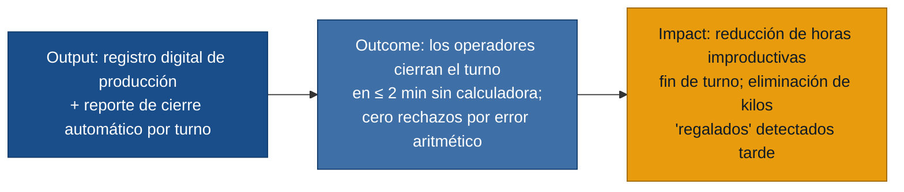

# MVP Canvas — Sistema de registro de producción Lecplast

## Cadena de valor

---

## Canvas

| Bloque | Contenido |
|---|---|
| **Propuesta de valor** | Eliminar el cierre de turno manual: los tres operadores registran la producción conforme avanza el turno y el sistema genera el reporte listo para validar en menos de 2 minutos, sin calculadora y sin papel. |
| **Segmento de usuarios** | Operadores de extrusión, impresión y sellado en turno de producción (Lecplast). |
| **Funcionalidades mínimas** | 1. Registro de rollos/lotes con peso durante el turno (flujo por rol). 2. Alerta de peso de rollo próximo al límite de la orden (extrusión). 3. Balance automático de materiales: insumos recibidos de bodega vs. producción + merma, por rol. 4. Generación del reporte de cierre de turno por rol, consultable en pantalla. |
| **Resultado esperado (outcome)** | Los operadores cierran el turno en ≤ 2 minutos. Los supervisores validan el reporte sin rechazarlo por errores aritméticos. Los kilos de rollo en exceso se detectan antes de que sea tarde. |
| **Métrica de éxito** | Tiempo promedio de cierre de turno ≤ 2 minutos en el 80 % de los turnos, medido durante el primer mes de uso. *(Prueba ácida: si baja de ~20 min a ≤ 2 min, el supervisor puede firmar antes y los operadores salen puntual — cualquier jefe de planta lo nota y puede decidir escalar o no el sistema.)* |
| **Riesgos / supuestos** | 1. Los operadores registrarán los datos durante el turno sin percibirlo como carga adicional (no se ha validado con ellos una maqueta). 2. La interfaz táctil es usable con guantes o manos sucias en entorno ruidoso y con iluminación de planta. 3. El supervisor aceptará el reporte digital como sustituto del papel firmado. 4. Las balanzas existentes en planta son suficientemente precisas para el registro de peso. |
| **Fuera de alcance (por ahora)** | Control automático de viscosidad de tintas (requiere sensores de hardware). Corrección de calibre de rollos (problema de proceso de la extrusora, no de software). Integración con ERP o sistema de inventarios de bodega. Sensor de conteo de bolsas (hardware adicional). Trazabilidad de calidad entre etapas. Gestión de órdenes de producción. |

---

## Notas de priorización

El dolor **reporte-manual** es el único que aparece en los tres roles con evidencia de primera mano y tiene un costo concreto (15-30 minutos improductivos al final de cada turno, más el bloqueo de salida si no cuadra). Es el ancla del MVP.

El dolor **control-peso-rollo** (extrusión) tiene impacto económico directo (kilos regalados) y se resuelve con US-01/US-02, que son parte del mismo flujo de registro, sin costo adicional de desarrollo.

Los dolores de **calidad de proceso** (calibre chueco, viscosidad, desperdicio de arranque) son reales pero no tienen palanca de software directa; resolverlos requeriría integración con maquinaria o cambios de proceso. Se excluyen del MVP para no comprometer el foco.
