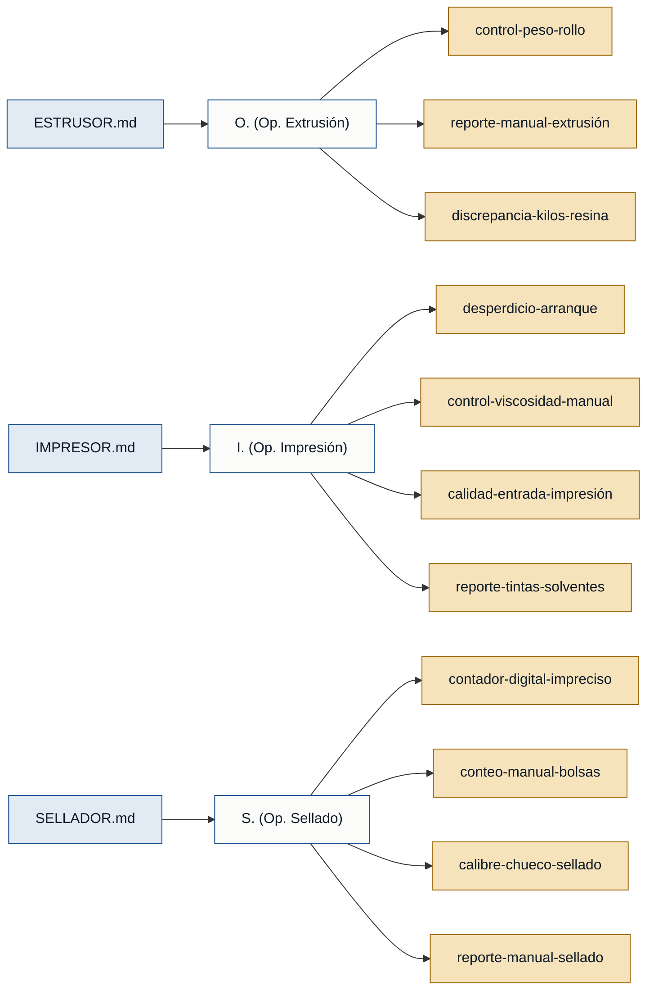

# Personas y Stakeholders — Lecplast

## Personas

### O. (Operador de extrusión) — operador de extrusión

- **Contexto:** Controla la torre de extrusión; su trabajo es la base de toda la cadena productiva porque si el rollo sale mal, impresión y sellado no pueden trabajar bien.
- **Objetivo principal:** Producir rollos con el peso neto exacto de la orden de producción, minimizando merma, y cerrar el turno con el balance cuadrado.
- **Dolores:**
  - Pérdida de control del peso del rollo en curso: ocupado en otras tareas, cuando regresa a la balanza el rollo ya se pasó con 2–3 kg de más → material regalado, pérdida directa. (ESTRUSOR.md)
  - Cierre de turno manual con calculadora del celular: anotar peso bruto, neto y canuto de cada rollo, sumar merma; si el total no cuadra, el supervisor no firma la salida. (ESTRUSOR.md)
  - Discrepancia entre kilos de resina despachados por bodega y kilos producidos + merma → bloqueo de salida hasta encontrar el error en el papel. (ESTRUSOR.md)
- **Respaldo:** `primera mano` (ESTRUSOR.md)

---

### I. (Operador de impresión) — operador de impresión (flexografía)

- **Contexto:** Recibe los rollos de extrusión y aplica diseños multicolor según especificación del cliente; trabaja con tintas al agua o al solvente y depende de la calidad del rollo de entrada.
- **Objetivo principal:** Obtener una impresión fiel al diseño del cliente con el mínimo desperdicio de película y un inventario de tintas que cuadre al final del turno.
- **Dolores:**
  - Desperdicio de 50–100 m de película en el arranque de cada diseño nuevo mientras se calibran los 4–6 colores. (IMPRESOR.md)
  - Control de viscosidad de tinta manual (tintero + cronómetro) y a ojo: si se descuida 5 minutos la tinta espesa, mancha la producción o tapa el anilox → material perdido. (IMPRESOR.md)
  - Calidad variable del rollo de entrada (estática o mal tratamiento de película) → tinta no agarra, producción rechazada. (IMPRESOR.md)
  - Reporte de tintas y solventes a mano al final del turno (kilos entregados, devueltos, solvente gastado) → errores de inventario → acusaciones de mala rendición o de guardar material. (IMPRESOR.md)
- **Respaldo:** `primera mano` (IMPRESOR.md)

---

### S. (Operador de sellado) — operador de sellado

- **Contexto:** Recibe rollos de extrusión o impresión, programa la selladora según medida del cliente y empaca bolsas en fardos exactos.
- **Objetivo principal:** Producir paquetes con el conteo exacto de bolsas buenas exigido por el cliente y cuadrar el reporte de turno sin errores.
- **Dolores:**
  - Contador digital de la selladora impreciso: bolsas pegadas o arrugas en el sensor se cuentan como una sola → conteo erróneo → bodega rebota el lote. (SELLADOR.md)
  - Conteo y separación manual de bolsas para armar paquetes exactos de 50 o 100 unidades mientras se vigila la máquina. (SELLADOR.md)
  - Material entrante con calibre desparejo (rollos del extrusor) → sello torcido o reventado → parada, limpieza de plástico derretido con riesgo de quemaduras. (SELLADOR.md)
  - Cierre de turno: cuadrar kilos de rollos − bolsas buenas − merma a mano con calculadora vieja → 15–20 min adicionales con espalda adolorida y ruido de máquinas. (SELLADOR.md)
- **Respaldo:** `primera mano` (SELLADOR.md)

---

## Stakeholders

### Supervisor de producción

- **Interés en el sistema:** Validar que los reportes de turno sean correctos antes de firmar la salida de los operadores; detectar desviaciones sin revisar hoja por hoja.
- **Fuente:** ESTRUSOR.md ("el supervisor no te firma la salida")

### Bodega

- **Interés en el sistema:** Mantener inventarios exactos de resinas, tintas, solventes y producto terminado; detectar desvíos sin esperar al cierre de turno.
- **Fuente:** ESTRUSOR.md ("los sacos de resina que te despachó bodega"); IMPRESOR.md ("te andan echando la culpa de que te estás guardando el material"); SELLADOR.md ("bodega te rebota el lote entero por reclamo del cliente")

### Cliente final

- **Interés en el sistema:** Recibir paquetes con el conteo exacto de bolsas pedido, sin reclamos por defectos ni faltantes.
- **Fuente:** SELLADOR.md ("el cliente te exige paquetes exactos de 50 o 100 bolsas")

### Empresa (gerencia)

- **Interés en el sistema:** Reducir las pérdidas de material por exceso de peso en rollos y por merma; tener visibilidad real de la producción por turno.
- **Fuente:** ESTRUSOR.md ("para la empresa es pérdida porque estás regalando material en el espesor")

---

## Mapa de trazabilidad

